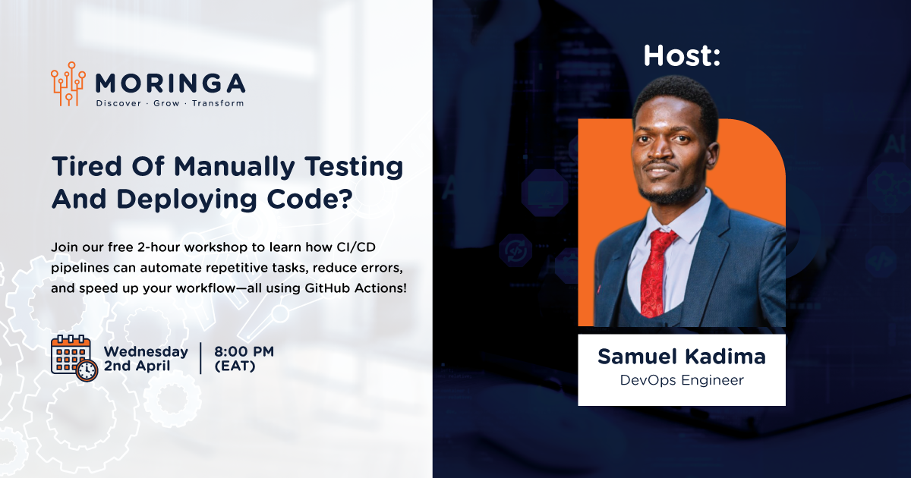

# Automate Your First CI/CD Pipeline with GitHub Actions: From Code to Deployment

## Workshop Overview
**Title:** Automate Your First CI/CD Pipeline with GitHub Actions: From Code to Deployment  
**Date & Time:** Wednesday 2nd April | 8:00 PM (EAT)  
**Duration:** 120 Mins  
**Format:** Interactive virtual workshop  
**Audience:** Developers, DevOps newbies, QA engineers, IT professionals, and tech enthusiasts.  
**Registration Link:** [Register here](https://lu.ma/mijg7yxy)

Tired of manually testing and deploying code? 
Join this hands-on workshop to learn how CI/CD pipelines can automate repetitive tasks, reduce errors, and speed up your workflow — all using **GitHub Actions**!

## Table of Contents
1. [Prerequisites](#prerequisites)
2. [What You’ll Learn](#-what-youll-learn)
3. [Perfect for](#-perfect-for)
4. [Workshop Objectives](#-workshop-objectives)
5. [Key Topics](#-key-topics)
6. [Ready to level up?](#-ready-to-level-up-your-devops-skills)

## Prerequisites
To get the most out of this workshop, ensure you have the following:
- **Python 3.10+** installed
- **Django 4+** installed (`pip install django`)
- **Git** installed
- **GitHub account** set up
- **Code editor** (VSCode, PyCharm, etc.)
- **Basic knowledge of Git** (commits, branches, push/pull)

---

## What You’ll Learn
- Build a pipeline from scratch to test and deploy code automatically.
- Master GitHub Actions basics (workflows, triggers, YAML syntax).
- Fix common pipeline failures like broken tests or deployment errors.
- Walk away with a deployable project for your portfolio.

### Perfect for:
- Developers new to DevOps
- QA engineers and IT pros
- Tech enthusiasts craving automation superpowers

No prior DevOps experience is required — just basic Git knowledge and a desire to automate!

---

## Workshop Objectives
- Introduce core **DevOps** principles and the role of **CI/CD** in modern software development.
- Guide attendees through creating a basic **CI/CD pipeline** using **GitHub Actions**.
- Demonstrate how to automate testing, building, and deploying a **Django** application.
- Equip attendees with foundational skills to explore advanced CI/CD tools and cloud platforms.

---

## Key Topics

### 🔹 Introduction to DevOps & CI/CD
- **What is DevOps?** Bridging development and operations.
- **Why CI/CD?** Faster releases, fewer errors, and better collaboration.

### 🔹 GitHub Actions Basics
- Understanding workflows, jobs, steps, and triggers (push/pull requests).
- Creating a "Hello World" workflow to understand **YAML** syntax.

### 🔹 Building a Real Pipeline
- Automate testing for a sample **Django** app.
- Deploy website to **Render**.
- Debug common pipeline failures (e.g., broken tests, deployment errors).

### 🔹 Best Practices & Next Steps
- **Security tips** for workflows (secrets management).
- **Scaling pipelines** and integrating with other tools (e.g., **Docker**, **AWS**).

##test

